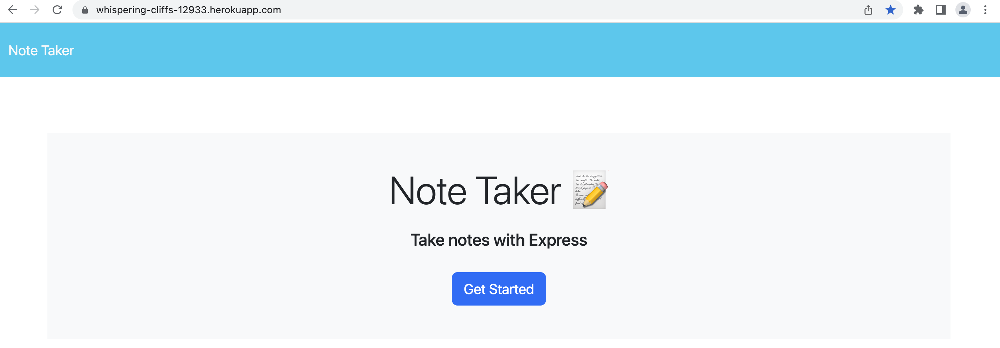

# Note-Taker

## Description

- The purpose of this repository is to create an application for small business owners to be able to write and save notes so they can organize their thoughts and keep track of tasks they need to complete.

## Usage

- [Click here](https://whispering-cliffs-12933.herokuapp.com/) to navigate to the live link of this repository.

---------------------------

- GIVEN a note-taking application, WHEN I open the Note Taker, THEN I am presented with a landing page with a link to a notes page:

---------------------------

- WHEN I click on the link to the notes page, THEN I am presented with a page with existing notes listed in the left-hand column, plus empty fields to enter a new note title and the note’s text in the right-hand column:

---------------------------

- WHEN I enter a new note title and the note’s text, THEN a Save icon appears in the navigation at the top of the page:

---------------------------

- WHEN I click on the Save icon, THEN the new note I have entered is saved and appears in the left-hand column with the other existing notes:

---------------------------

- WHEN I click on an existing note in the list in the left-hand column, THEN that note appears in the right-hand column:

---------------------------

- WHEN I click on the Write icon in the navigation at the top of the page, THEN I am presented with empty fields to enter a new note title and the note’s text in the right-hand column:

---------------------------

## Credit

### Resources :books:
- Bootcamp Materials
- Challenge demonstration by TA in class
- Tutor
- AskBCS Learning Assistant

### Assets :sparkles:
- Files and front-end code in *public* folder, *db* folder, and *package.json* are provided by bootcamp materials
- [Express Package](https://www.npmjs.com/package/express/v/4.16.4)
- [uuid Package](https://www.npmjs.com/package/uuid)

### Applications Used :gear:
- VS Code
- Heroku

Thank you for visiting! :ribbon:
